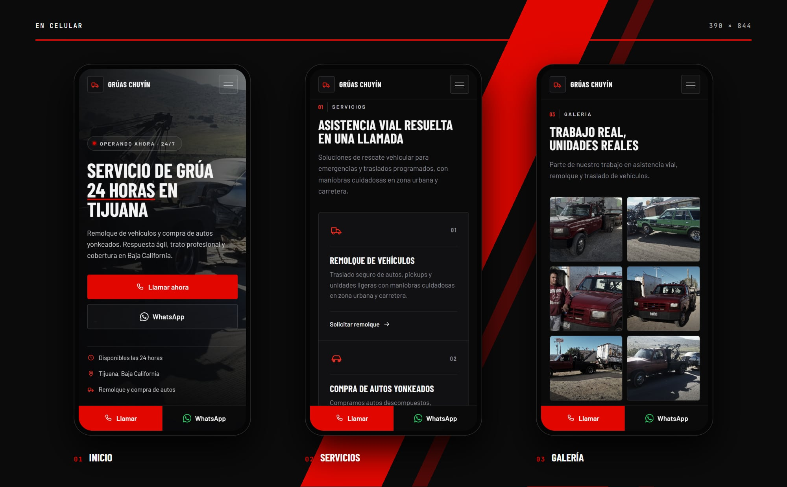

<p align="center">
  
</p>

<h1 align="center">Grúas Chuyín</h1>

<p align="center"><b>Grúa 24 horas en Tijuana</b></p>

<p align="center">
  
  
  
  
</p>

## Sobre el proyecto

Landing de **Grúas Chuyín**, servicio de grúa 24 horas en Tijuana: remolque de vehículos y compra de autos yonkeados, con llamada y WhatsApp a un toque desde cualquier parte de la página.

Es un sitio estático, hecho con HTML, CSS y JavaScript, sin frameworks ni proceso de build.

## Secciones

| Sección | Contenido |
| --- | --- |
| **Servicios** | Remolque y compra de autos yonkeados |
| **Cobertura** | Tijuana y alrededores |
| **Galería** | Trabajo real con las unidades de la empresa |
| **Contacto** | Llamada y WhatsApp |

## En computadora

<p align="center">
  
</p>

## En celular

<p align="center">
  
</p>

## Tecnologías

- HTML5, CSS3 y JavaScript.
- Diseño adaptable a celular, tableta y computadora.
- Íconos con un sprite SVG en línea, sin librerías externas (ver `CLAUDE.md`).
- Tipografías de Google Fonts: Barlow y Barlow Condensed.
- Publicado en Cloudflare Pages.

## Estructura

```
GruasChuyin/
├── 1.jpeg
├── 2.jpeg
├── 3.jpeg
├── 4.jpeg
├── 5.jpeg
├── 6.jpeg
├── CLAUDE.md               # Guía del proyecto
├── docs/                   # Imágenes de este README
├── favicon.svg
├── index.html              # Página principal
├── Info.jpeg
├── script.js               # Interacciones y animaciones
└── styles.css              # Estilos
```

## Créditos

Desarrollado por Salereee. Logotipos, fotografías y textos del negocio pertenecen a Grúas Chuyín.
