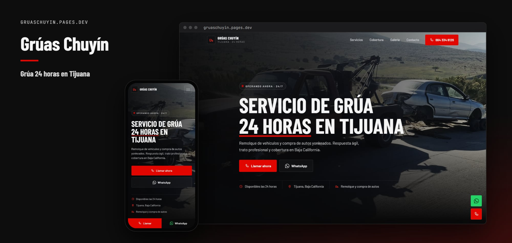
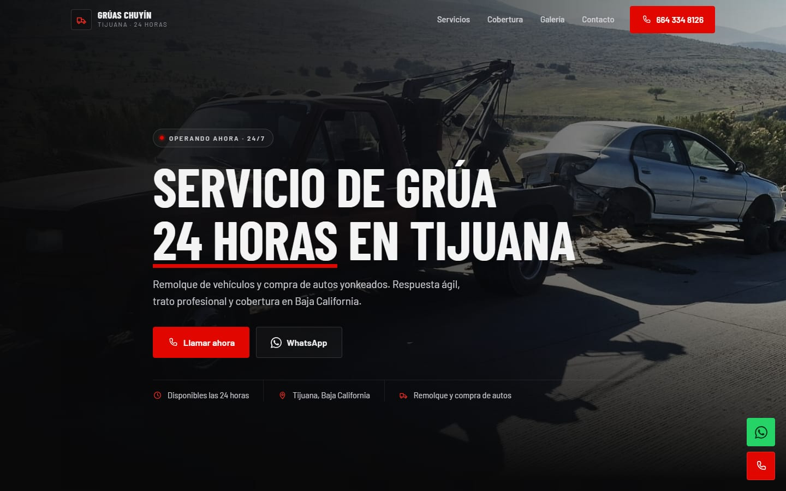
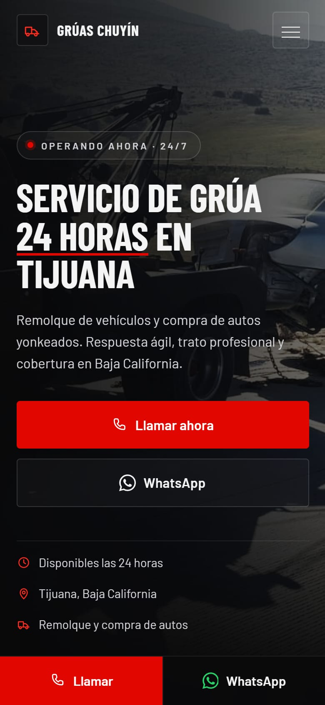

<p align="center">
  
</p>

<h1 align="center">Grúas Chuyín</h1>

<p align="center"><b>Grúa 24 horas en Tijuana</b></p>

<p align="center">
  <a href="https://gruaschuyin.pages.dev/"><b>Ver el sitio →</b></a><br><br>
  
  
  
  
</p>

## Sobre el proyecto

Landing de **Grúas Chuyín**, servicio de grúa 24 horas en Tijuana: remolque de vehículos y compra de autos yonkeados, con llamada y WhatsApp a un toque.

Es un sitio estático: HTML, CSS y JavaScript sin frameworks ni proceso de build.

## Secciones

| Sección | Contenido |
| --- | --- |
| **Servicios** | Remolque y compra de autos yonkeados |
| **Cobertura** | Tijuana y alrededores |
| **Galería** | Fotos de las unidades |
| **Contacto** | Llamada y WhatsApp |

## Capturas

<p align="center">
  
  &nbsp;
  
</p>

## Tecnologías

- HTML5, CSS3 y JavaScript, sin frameworks ni proceso de build.
- Tipografía de Google Fonts (Barlow y Barlow Condensed).
- Diseño adaptable a celular, tableta y computadora.
- Íconos con un sprite SVG en línea (sin librerías de íconos). Ver [`CLAUDE.md`](CLAUDE.md) para las reglas de rendimiento y diseño.
- Publicado en **Cloudflare Pages**.

## Estructura

```
GruasChuyin/
├── 1.jpeg
├── 2.jpeg
├── 3.jpeg
├── 4.jpeg
├── 5.jpeg
├── 6.jpeg
├── CLAUDE.md                   # Guía del proyecto
├── docs/                       # Imágenes de este README
├── favicon.svg
├── index.html                  # Página principal
├── Info.jpeg
├── script.js                   # Interacciones (menú, animaciones)
└── styles.css                  # Estilos
```

## Correr en local

No necesita instalar nada. Abre `index.html` en el navegador, o sírvelo desde la carpeta del repo:

```bash
python -m http.server 8000
```

y entra a <http://localhost:8000>.

## Créditos

Desarrollado por [@Salereee](https://github.com/Salereee). Logotipos, fotografías y textos del negocio pertenecen a Grúas Chuyín.
